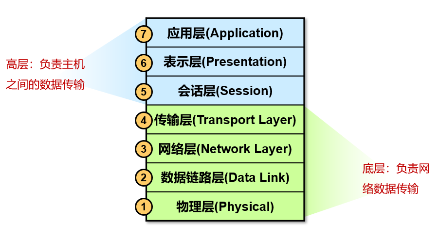
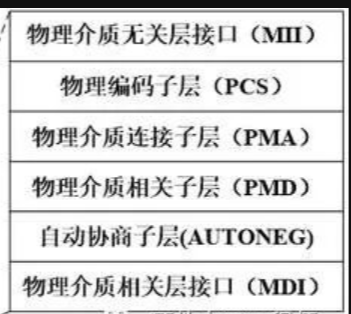

# SerDes知识

SerDes是Serializer/Deserializer的缩写，即串行器和解串器，顾名思义是一种将并行数据转换成串行数据发送，将接收的串行数据转换成并行数据的”器件“。

## [并行数据]

并行数据是指通过多条信号线**同时**传输多位数据。每条信号线负责传输一位数据，所有信号线上的数据在**同一时钟周期**内到达接收端。

### **特点**

* 并行传输：多条信号线同时工作（如 8 条、16 条或更多）。

* 高传输速率（短距离时）：因为每次传输的数据位数较多，理论上传输速率更高。

* 适合短距离传输：当距离较短时，信号同步容易，性能较好。

### 优点

* 数据传输速度快（因为多位数据同时传输）。

* 在短距离内，硬件设计较简单。

### 缺点

* 信号同步问题：多条信号线上的数据需要保持时钟同步，距离越长，信号同步难度越大。

- 布线复杂：需要多条信号线，增加布线和电路设计复杂度。

- 高成本：线缆和连接器成本较高。

### 应用场景

- 短距离、高速数据传输场景，如 CPU 内部总线（比如 32 位或 64 位并行总线）。

- 内存总线（如 DDR SDRAM 和处理器之间的通信）。

## [串行数据]

串行数据是指通过**单条信号线**按顺序**逐位**传输数据。发送端将数据从并行格式转为串行格式传输，接收端再将串行数据转回并行格式。

### 特点

逐位传输：一条信号线上一次只能传输 1 位数据。

传输速度高（长距离时）：由于减少了信号线数量和同步问题，串行传输在长距离时更稳定。

信号线简单：只需要一条数据线（有时加上时钟线）。

### 优点

长距离传输能力强：减少了信号线数量，降低了同步误差的概率。

布线简单：只需要一条数据线，电路和连接器设计更简单。

低成本：线缆和接口硬件更便宜。

### 缺点

数据传输速度可能受限于单线的速率，如需提高速率需要通过提高时钟频率补偿。

### 应用场景

长距离数据传输，如 USB、HDMI、SATA、以太网、PCIe。

高速串行通信协议（如 SPI、I2C、UART）。

## Comparison

| **特性**         | **并行数据传输**                   | **串行数据传输**                    |
| ---------------- | ---------------------------------- | ----------------------------------- |
| **传输方式**     | 多条信号线同时传输多位数据         | 单条信号线逐位传输数据              |
| **硬件复杂度**   | 高（需要多条信号线和同步机制）     | 低（信号线少，设计简单）            |
| **成本**         | 高（多条信号线和连接器）           | 低（少量信号线）                    |
| **信号同步问题** | 存在（需要确保多条信号线的同步性） | 基本没有（单线逐位传输）            |
| **传输距离**     | 适合短距离（信号同步容易）         | 适合长距离（信号干扰和同步问题少）  |
| **传输速率**     | 在短距离时传输速率高               | 在长距离时传输速率高                |
| **典型应用**     | CPU 总线、内存总线、打印机并口     | USB、HDMI、以太网、串口通信（UART） |
| **选择**         | 短距离传输（芯片内部、板内通信）   | 长距离传输（设备间通信）            |

## **SerDes 芯片的架构介绍**

SerDes（Serializer/Deserializer）是高速数据通信中的核心技术，其主要目的是在不同设备或芯片之间实现高速、长距离的数据传输。SerDes芯片架构的设计非常关键，决定了数据传输的性能、功耗和可靠性。

### **概述**

SerDes芯片架构主要由两部分组成：

* **Serializer（串行器）：**
  * 负责将并行数据转换为串行数据流。

  * 主要用于减少传输通道的数量，从而降低硬件成本和复杂性。

* **Deserializer（解串器）：**

  - 负责将接收到的串行数据流还原为并行数据。
  - 主要用于支持下游设备或芯片的进一步处理。

**SerDes架构的目标是：**

- 高数据速率传输：支持多Gbps甚至Tbps的数据传输速率。
- 低功耗：优化功耗以适应现代通信和计算需求。
- 低误码率（BER）：保证传输的准确性和稳定性。

### **主要工作**

1.   **高速数据传输**

     - 在设备（如CPU、GPU、存储设备、通信设备）之间传输数据。
     - 应用于PCIe、以太网、USB、HDMI等协议中。

2.   **信号完整性与误码控制**
     - 在高速传输中，信号容易受到噪声、串扰和信号衰减的影响。SerDes通过架构设计，提升信号完整性，降低误码率。

3.   **节约硬件资源**

     - 通过串行化技术减少传输所需的物理通道数，降低成本。
     - 在布线复杂的高速PCB设计中，SerDes尤为重要。

4.   **支持多种通信协议**
     - SerDes芯片通常需要兼容不同的通信协议，比如PCIe、SATA、以太网、DisplayPort等。

5.   **待补充......**

### **Arch实现模块**

1. **串行器部分**（Serializer）

- 工作原理：
  - 接收来自上游设备的多路并行数据。
  - 将这些数据通过多路复用器（Multiplexer, MUX）合并成一条高速串行数据流。
- 关键技术：
  - 时钟多路复用：利用高频时钟将低速并行数据编码到高速串行通道中。
  - 编码技术：如8b/10b或64b/66b编码，确保DC平衡和时钟恢复。

2. **解串器部分（Deserializer）**

- 工作原理：
  - 接收来自串行通道的高速数据流。
  - 通过多路分解器（Demultiplexer, DEMUX）将串行数据恢复为并行数据。
- 关键技术：
  - 时钟数据恢复（Clock Data Recovery, CDR）
    - 从接收到的串行数据中提取嵌入的时钟信号。
  - 均衡器
    - 补偿信号在传输过程中的衰减，恢复原始波形。
    - 包括前馈均衡（FFE）、决策反馈均衡（DFE）等。

3. **时钟管理模块**

- 锁相环（Phase-Locked Loop, PLL）

  * 生成高精度的时钟信号，为串行化和解串化提供稳定的频率。

- 时钟恢复模块

  * 在接收端从数据流中提取时钟信号，保持发送端和接收端的同步。

  4. **信号调节与均衡模块**

- 前馈均衡器（FFE）
  - 在发送端用于预先补偿信号失真。
- 决策反馈均衡器（DFE）
  - 在接收端实时校正信号中的噪声和失真。

  5. **接口与协议适配**

- SerDes通常集成协议栈，以支持各种行业标准协议（如以太网、PCIe等）。

## 技术概览

常用的FPGA、DSP中经常都会集成到SerDes技术，其本质就是并串、串并转换器。

本质的目的是提高传输速度，原则上多加几条线增加芯片间的管脚互联可以实现，但是这种方式的上限极低。随着芯片的小型化，加线即等于加引脚（物理接口），小型化的芯片不可能再加引脚，所以到了后期的发展是不现实的。

SerDes可以减少信号传输所需的信道和引脚的数目，从而减少传输线之间的干扰，增加背板传输距离。原本需要几条线传输的数据，要挤到一起去传输。为了提高速度，信号的完整性和时钟基数就成了SerDes要解决的首要问题。（给信号的抖动非常小）

To be solve: 时钟扭曲、信号衰减、线路噪声 etc,.

平时常见的通信协议，例如PCIE, nvlink, SATA, usb等等很多都是基于SerDes的协议,因此SerDes其实更接近于物理层(PHY层), 是一个[PHY层器件](###PHY层器件：)。

**SerDes的三大模块：**Tx、Rx、[PLL（锁相环）](### 锁相环). PLL通过相位锁定的方法锁定时钟，有分频和倍频的功能

### PHY层器件：

**物理层**（Physical Layer）是[计算机网络](https://zh.wikipedia.org/wiki/计算机网络)  [OSI模型](https://zh.wikipedia.org/wiki/OSI模型)中最低的一层，也是最基本的一层。简单的说，网络的物理层面确保原始的数据可在各种物理媒体上传输。物理层器件PHY(Physical Layer Interface Devices)是将各网元连接到物理介质上的关键部件。负责完成互连参考模型(OSI)第1层中的功能，即为链路层实体之间进行bit传输提供物理连接所需的机械、电气、光电转换和规程手段。实现物理层比特bit流的透明传输等。

如图，上图是OSI的七层模型，下图是物理层的结构。物理层包括四个功能层和两个层接口，四个功能层为：物理编码子层、物理介质连接子层、物理介质相关子层和自动协商子层；两个层接口为物理介质无关层接口（MII）和物理介质相关层接口（MDI），在MII的上层是逻辑数据链路层（DLL），而MDI的下层则直接与传输介质相连，以太网物理层PHY芯片实现的功能就是上面所提到的四层和两个接口的功能。

### 锁相环
